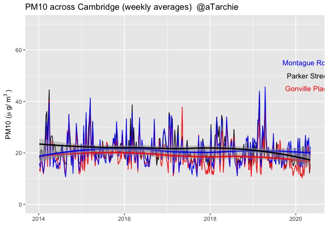

COVID Analysis Cambridge
================
Alexander Archibald
11/05/2020

## Air quality changes in Cambridge and COVID-19 lockdowns

This document presents some analysis on the recent changes in air
pollutants recorded by air quality monitoring sites across Cambridge.

Let’s start by looking at where the data come from.
<!-- -->

The map above shows the locations of the air quality monitoring sites in
Cambridge. They are:

    ## # A tibble: 4 x 4
    ##   site                     code  latitude longitude
    ##   <chr>                    <chr>    <dbl>     <dbl>
    ## 1 Cambridge Parker Street  CAM1      52.2     0.126
    ## 2 Cambridge Gonville Place CAM3      52.2     0.128
    ## 3 Cambridge Newmarket Road CAM4      52.2     0.142
    ## 4 Cambridge Montague Road  CAM5      52.2     0.137

    ## # A tibble: 1 x 5
    ##   site               code  latitude longitude site_type    
    ##   <chr>              <chr>    <dbl>     <dbl> <chr>        
    ## 1 Cambridge Roadside CAM       52.2     0.124 Urban Traffic

Note, that the AURN site (Cambridge Roadside) is the Cambridge Council
Building site on Regent Street.

## Analysis of the data over several years

The DEFRA AURN site outside the Council offices on Regent Street has
data for over a decade but the other sites on the map only have data
available for analysis from 2014.

These data are plotted below for three main air pollutants:

1)  Nitrogen dioxide (NO\(_2\)). This is a gaseous compound that comes
    from the combustion of fossil-fuels. It is very reactive in the
    atmosphere and has a lifetime of much less than a day. During the
    day sunlight breaks down NO\(_2\) and at night time reactions with
    ozone (O\(_3\)) convert NO\(_2\) into the nitrate radical
    (NO\(_3\)).

2)  Particulate matter less than 10 microns in diameter (PM10) PM10 is
    an aerosol (a solid/liquid suspended in a gas) which comes from a
    large number of sources such as dust from roads, sea spray,
    combustion, construction work, break wear etc. PM10 tends to have a
    lifetim much longer than a day and gets washed out by things like
    rain.

3)  Particulate matter less than 2.5 microns in diameter (PM2.5) PM2.5
    is a very fine (small) aerosol. This has been shown through many
    epidemiological studies to be a very important air pollutant.
    Sources of PM2.5 include primary (direct emissions of particles) and
    secondary (conversion of gases to particles and sticking together of
    very small particles)

<!-- -->

The long term time-series for NO\(_2\) is shown above. A few key points
stick out:

1)  Parker Street has the heighest levels of NO\(_2\) measured in
    Cambridge.

2)  There has been a long term decrease in NO\(_2\) in Cambridge over
    time.

3)  There is significant variability in NO\(_2\) from week to week (the
    spikes in the data).

In the plots above weekly-average data are shown with a smoothed running
average (LOESS) added to highlight trends. If you stare at the data you
will see that there is a repeating seasonal-cycle, where NO\(_2\) levels
peak in the winter and drop to a minimum in the summer. This type of
behaviour is very typical for NO\(_2\) and is seen in most places around
the world. The causes are a combination of meteorology and chemistry.

The downwards trends in NO\(_2\) are likely to be driven by emission
changes, particularly related to vechicle fleet changes and better
catalytic converters in vehicles.

<!-- -->

The plot above shows the trends in PM10 since 2014. As with the NO\(_2\)
time-series plot, there are some trends (shown in the smoothed fits) but
these are much smaller than with NO\(_2\).

There are fewer sites measuring PM10 than NO\(_2\) but the sites that
measure PM10 tend to agree on the tiimg of spikes in the data. This
partly reflects the long lifetime of PM10 and the fact that the sources
of PM10 are not local (unlike NO\(_2\) which has major local sources,
particular vehicle emissions).

<!-- -->

Finally, the plot above focuses on the finer aerosol, PM2.5. In general
the picture is similar to the picture with PM10 in that the sites that
measure PM2.5 show high levels of correlation in time – highlighting the
importance of sources of PM2.5 away from the measurement sites.

Next we focus on the changes that have occured in 2020 – particulalrly
during the COVID-19 lockdown period.

## Changes in air quality during the lockdown

<!-- --><!-- --><!-- --><!-- --><!-- -->

First let’s look at the changes in NO\(_2\) during the lockdown. The
plots above show NO\(_2\) at each of the sites that measure it during
2020 and compare the daily average values (the noisy lines) with the
average you would expect based on analysis of data from 2017-2019 (three
years).

  - Why compare against these three years? Well, firstly they are the
    most recent three year period.
  - Secondly, by averaging over three years we eliminate large
    fluctuations that happen because of changes in meteorology from year
    to year.

<!-- --><!-- --><!-- -->

<!-- --><!-- -->
